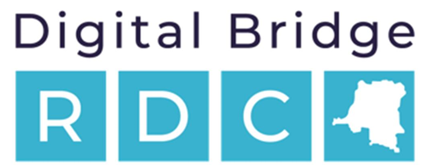

# 🛠️ Drones - Outils Utiles

Voici une collection d’outils et de ressources indispensables pour configurer, piloter, et apprendre à utiliser des drones, avec une préférence pour les ressources en **langue française**.

## 🧭 Betaflight Configurator
Configuration des drones FPV avec Betaflight.

- 🔗 [Téléchargement (GitHub)](https://github.com/betaflight/betaflight-configurator/releases)
- 🌐 [Version Web 11+](https://app.betaflight.com/#)
- 📖 [Guide en français (OscarLiang)](https://oscarliang.com/fr/betaflight-configuration/)
- 🎓 [Tutoriel vidéo (YouTube - FrenchFPV)](https://www.youtube.com/watch?v=Oljg8zZrUAw)

---

## 🛰️ INAV Configurator
Pour les vols automatisés, GPS, et navigation avancée.

- 🔗 [Téléchargement (GitHub)](https://github.com/iNavFlight/inav-configurator/releases)
- 📘 [Documentation officielle](https://github.com/iNavFlight/inav-docs)
- 🎥 [Tutoriel français (DroneLab)](https://www.youtube.com/watch?v=y2aCEeTZ0Kw)

---

## 📡 ELRS (ExpressLRS) Configurator
Pour flasher et configurer les récepteurs ExpressLRS.

- 🔗 [Téléchargement (GitHub)](https://github.com/ExpressLRS/ExpressLRS-Configurator/releases)
- 📚 [Guide ExpressLRS en français (Modelisme Drone)](https://modelisme-drone.fr/expresslrs-le-guide/)
- 🛠️ [Firmware Builder Web](https://www.expresslrs.org/2.0/quick-start/getting-started/)

---

## ⚡ ESC Configurator
Configuration et mise à jour des ESC BLHeli.

- 🌐 [BLHeli_32 ESC Configurator Web](https://esc-configurator.com/)
- 📄 [Guide complet sur les ESC (Helicomicro)](https://www.helicomicro.com/esc-les-variateurs/)

---

## 📚 Guides & Tutoriels Recommandés

### 🔧 Montage & Réglage
- [🔗 Culture FPV - Tutoriels débutants](https://www.youtube.com/c/CultureFPV)
- [📘 Guide PDF sur la construction de drones FPV (FPV-Passion)](https://fpv-passion.fr/guide-debutant-drones-fpv/)

### 🧪 Simulateurs
- 💻 [Liftoff](https://store.steampowered.com/app/410340/Liftoff_FPVRacing/)
- 💻 [FPV.SkyDive (gratuit)](https://fpv.skydive.game/)
- 🎮 [Velocidrone](https://www.velocidrone.com/)

### 🛍️ Boutiques Francophones
- 🇫🇷 [Studiosport](https://www.studiosport.fr/)
- 🇫🇷 [Drone-FPV-Racer](https://www.drone-fpv-racer.com/)

### 🎒 Matériel et Accessoires
- 🔋 [Tout sur les batteries LiPo](https://www.helicomicro.com/les-batteries-lipo/)
- 🔧 [Impression 3D pour drones (Thingiverse)](https://www.thingiverse.com/)

---

## 🧠 Communautés Francophones

- 💬 [Forum Modelisme Drone](https://forum.modelisme.com/forum/drones/)
- 💬 [Groupe Facebook : FPV Francophone](https://www.facebook.com/groups/fpvfrancophone/)
- 📢 [Discord : FPV France](https://discord.gg/fpvfr)
